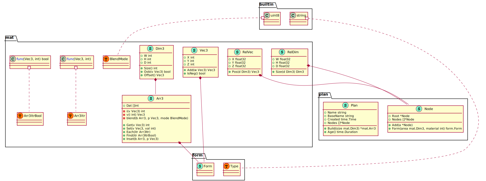

  

### My latest over-ambitious project to create a game where all the content is generated using evolutionary algorithms.

UML Diagram of the components so far:

Hopefully this system of components can model most of the content in the game. So far I've only really considered structures for POI generation but will eventually need to modify this framework to generate mobs.

Here are some tests of the data structures and methods that will be used to generate POI structures within the game:

  
  

These are purely random structures, but without the abilty to view what generated it's going to be difficult to judge whether or not anything is working.
