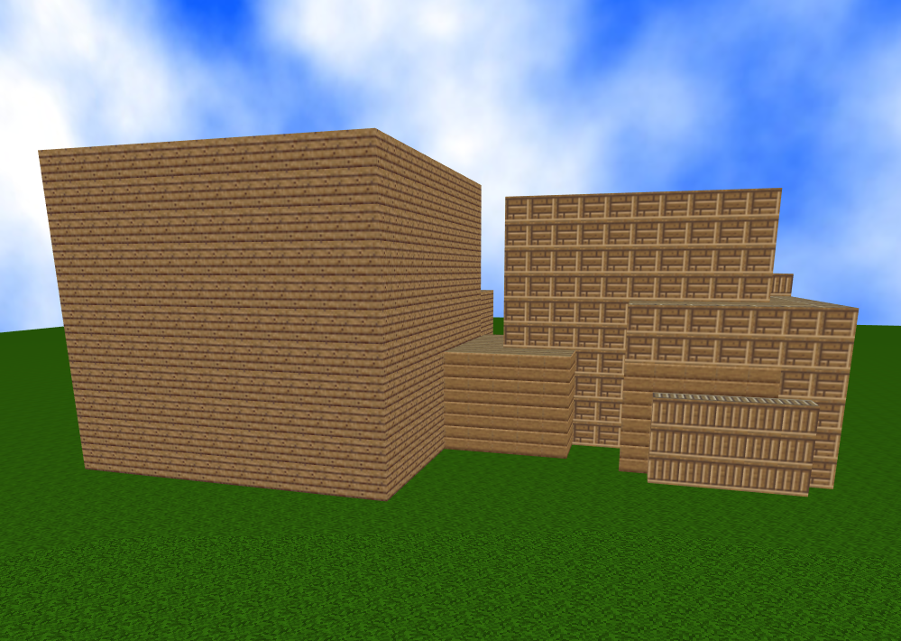
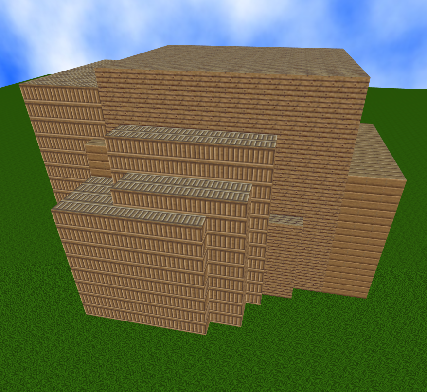
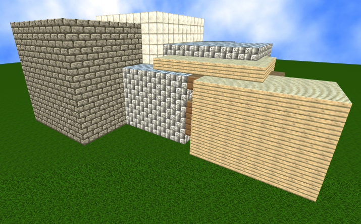

<p align="center">
  
</p>

### My latest over-ambitious project to create a game where all the content is generated using evolutionary algorithms.

So far, the code can take a structure like this:

```javascript
{
	"BaseName": "",
	"Created": "2020-11-14T10:46:18.8482241-05:00",
	"Nodes": [
		{
			"W": 0.4,
			"H": 0.4,
			"D": 0.4,
			"X": 0,
			"Y": 0,
			"Z": 0,
			"Material": 2,
			"Nodes": [
				{
					"W": 0.8,
					"H": 0.8,
					"D": 0.8,
					"X": 1.2,
					"Y": -1.5,
					"Z": 0.9,
					"Material": 3
				},
				{
					"W": 0.9,
					"H": 0.9,
					"D": 0.9,
					"X": -1.2,
					"Y": 1.5,
					"Z": 0.9,
					"Material": 4
				},
				{
					"W": 0.7,
					"H": 0.7,
					"D": 0.7,
					"X": 1.2,
					"Y": -1.5,
					"Z": -0.9,
					"Material": 6
				}
			]
		}
	]
}
```

and produce a voxel object like so:

<p align="center">
  
</p>

Hopefully this system of components can model most of the content in the game. So far I've only really considered structures for POI generation but will eventually need to modify this framework to generate mobs.

## Creating a crude GAN generator/discrimator

Can create building-ish structures now using a random generator:

<p align="center">
  
</p>

A simple discriminator has been implemented using this formula: total blocks / possible size. A score of 1 means all voxels within the given space are filled in. Here's the output of that discriminator after 1000 generations:

<p align="center">
  
</p>

Second discriminator gives higher scores to structures that cost more resources than others. Iron/stone blocks are considered to be costlier than wood or dirt.

<p align="center">
  
</p>

Next few discriminator ideas (unsure of real implementation):

* One that gives high scores to mid-range structures
* Somehow determine if the structure is easy to attack/defend
* Efficient structures
* Roomy (most interior space)
* Easy to travel within
* Maximized material usage (large but fewer forms)

Needed generator improvements:

* Doors/windows
* Rooms shouldn't generate blocks inside other rooms
