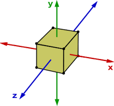

# mat.Notes

## Offsets and Origins

Using relative vectors and dimensions should allow this system to represent a wide variety of structures with the outcome being a finite, discrete object. However, developing finite results from this functionality presents its own set of problems.

### Translating relative vectors to a physical location within a voxel space

To start with an example: Given a relative vector that represents a position within a voxel space that has a value of { 0.5, 0.5, 0.5 }, how do we find its actual location within a voxel space that has the dimensions { 4, 4, 4 }? We can't simply multiply the vectors because the voxel space with these dimensions conceptually extends from -2 to 2 in each spatial axis.

One way to find the phsyical position would be to convert the vector used to represent the scalar of the voxel space, which gives us {2, 2, 2}, and then multiply that value with the relative position which gives us { 1, 1, 1 }. 

## Origins Of Voxel Space

If the center of a given voxel space is {0, 0, 0}, how do we set the value of the voxel located at that position? To poorly represent this final position, here's a diagram that requires a great amount of imagination:

### Block positioned at { 0, 0, 0 } within a 4x4 voxel space (0 at center, rounding down)

    front            left             down
    [ ][ ][ ][ ]     [ ][ ][ ][ ]     [ ][ ][ ][ ]
    [ ][X][ ][ ]     [ ][X][ ][ ]     [ ][X][ ][ ]
    [ ][ ][ ][ ]     [ ][ ][ ][ ]     [ ][ ][ ][ ]
    [ ][ ][ ][ ]     [ ][ ][ ][ ]     [ ][ ][ ][ ]

    Block is offset slightly from center which is noticeable when using smaller spaces.

Obviously, we can see that the higher the resolution the better off we are at depicting results. If the voxel space were 100x100x100 in size having the origin offset by one voxel wouldn't make much of a difference when rendered, but since I do not have a GTX3080 yet, I am trying to start with smaller spaces in case I need to implement a CNN or GAN using three-dimensional convolutional layers. We could employ some tricks when rendering the final result like ensuring the the container's dimensions are always odd to allow for a "center" voxel:

### Block positioned at { 0, 0, 0 } within a 5x5 voxel space would appear to be in the exact center

    front               left                down
    [ ][ ][ ][ ][ ]     [ ][ ][ ][ ][ ]     [ ][ ][ ][ ][ ]
    [ ][ ][ ][ ][ ]     [ ][ ][ ][ ][ ]     [ ][ ][ ][ ][ ]
    [ ][ ][X][ ][ ]     [ ][ ][X][ ][ ]     [ ][ ][X][ ][ ]
    [ ][ ][ ][ ][ ]     [ ][ ][ ][ ][ ]     [ ][ ][ ][ ][ ]
    [ ][ ][ ][ ][ ]     [ ][ ][ ][ ][ ]     [ ][ ][ ][ ][ ]
